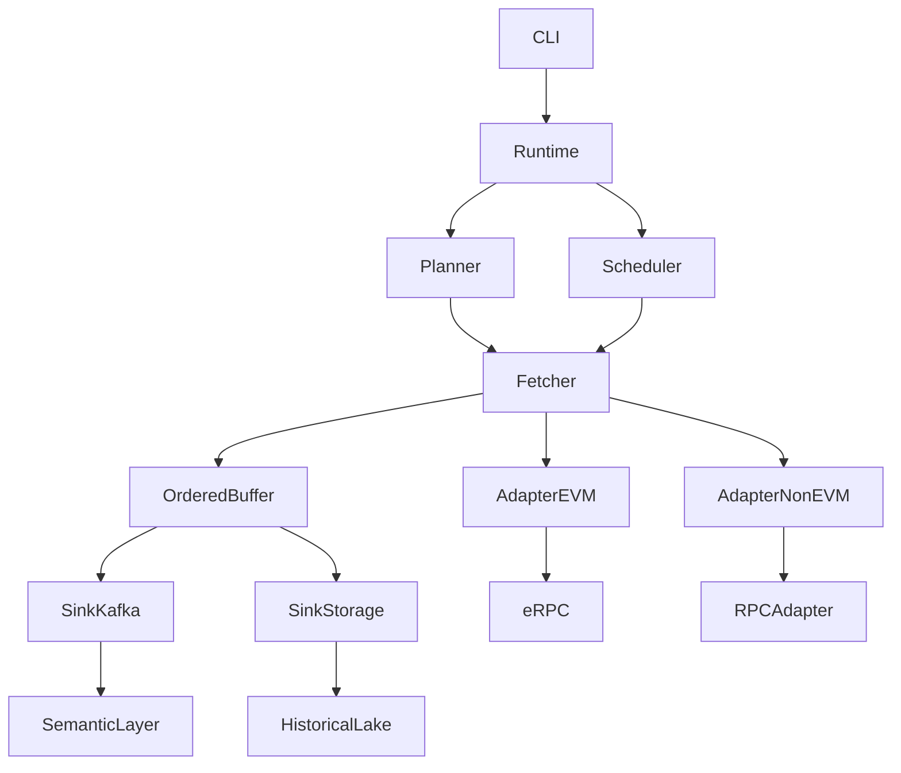

# Chainlake Stream Ingestion (WIP)

***Project Progress***:  `[##--------]` 10%

Chainlake Stream Ingestion is a Python-based async-first blockchain ingestion engine designed for:

- low-latency realtime stream ingestion  
- high-throughput historical backfill  
- horizontal scalability  
- ordered block delivery  
- multi-chain adapter extensibility  

It is built as the core ingestion runtime for Chainlake semantic data infrastructure.

---

# Why This Project Exists

Most existing blockchain ETL tools are optimized for historical export:

- sync RPC calls  
- sequential block processing  
- file/database export pipelines  

They are reliable for backfill, but not designed for modern realtime semantic data systems.

Chainlake Stream Ingestion focuses on:

- async RPC concurrency  
- inflight scheduling  
- ordered buffering  
- async sink delivery  
- stream-native observability  

This enables realtime semantic layers with much lower end-to-end latency.

---

# Core Features

## Async Native Runtime

- async block fetch
- concurrent inflight scheduling
- non-blocking result handling

## Ordered Delivery

Out-of-order RPC results are buffered and committed in canonical block order.

## High Throughput Batch + Low Latency Stream

Supports:

- historical backfill mode
- realtime head tracking mode

using the same runtime core.

## eRPC Integration

For EVM chains:

- retry
- timeout
- rate limiting
- RPC failover

through eRPC integration.

## Multi-Chain Adapter Design

Current:

- EVM first

Future:

- Sui
- Aptos
- Solana

through adapter abstraction.

## Async Sink Layer

Supports pluggable output sinks:

- Kafka
- Parquet
- Iceberg
- ClickHouse

---

# Architecture



---

# Project Structure

```text
chainlake-stream-ingestion/
├── cli/
├── chainlake_stream/
│   ├── adapters/
│   ├── rpc/
│   ├── planner/
│   ├── runtime/
│   ├── execution/
│   ├── state/
│   ├── sinks/
│   ├── metrics/
│   ├── models/
│   ├── utils/
│   └── config/
├── deployments/
├── tests/
├── scripts/
```

---

# Runtime Layers

## adapters/

Chain-specific parsing and RPC abstraction.

## rpc/

Transport-level retry / timeout / rate limit control.

## planner/

Range slicing and block scheduling.

## runtime/

Main orchestration engine.

## execution/

Fetch + reorder + merge pipeline.

## state/

Checkpoint / cursor / replay state.

## sinks/

Kafka / storage outputs.

## metrics/

Prometheus / tracing / runtime observability.

---

# Supported Modes

## Realtime Stream Mode

Optimized for:

- latest block ingestion
- low-latency semantic updates

## Batch Backfill Mode

Optimized for:

- large historical range export
- maximum throughput

---

# Future Roadmap

## V1

- EVM stable runtime
- Kafka sink
- ordered buffer
- Prometheus metrics

## V2

- Iceberg sink
- replay state persistence
- non-EVM adapters

## V3

- unified semantic ingestion engine
- exactly-once end-to-end delivery

---

# Positioning

Chainlake Stream Ingestion is not a traditional ETL exporter.

It is designed as:

> blockchain stream runtime infrastructure

for modern semantic data systems.

---

# License

Apache-2.0
